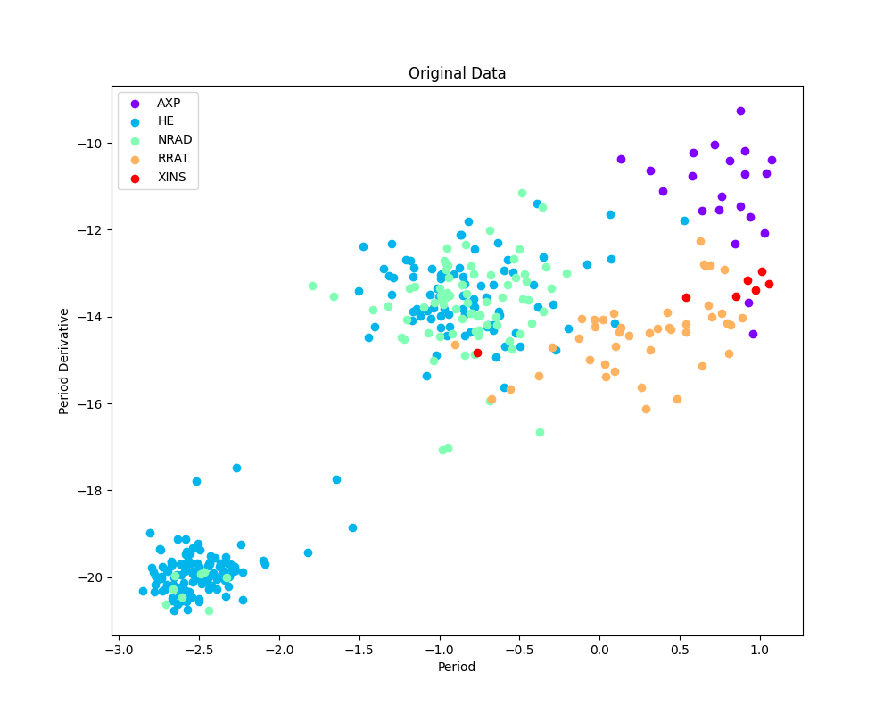
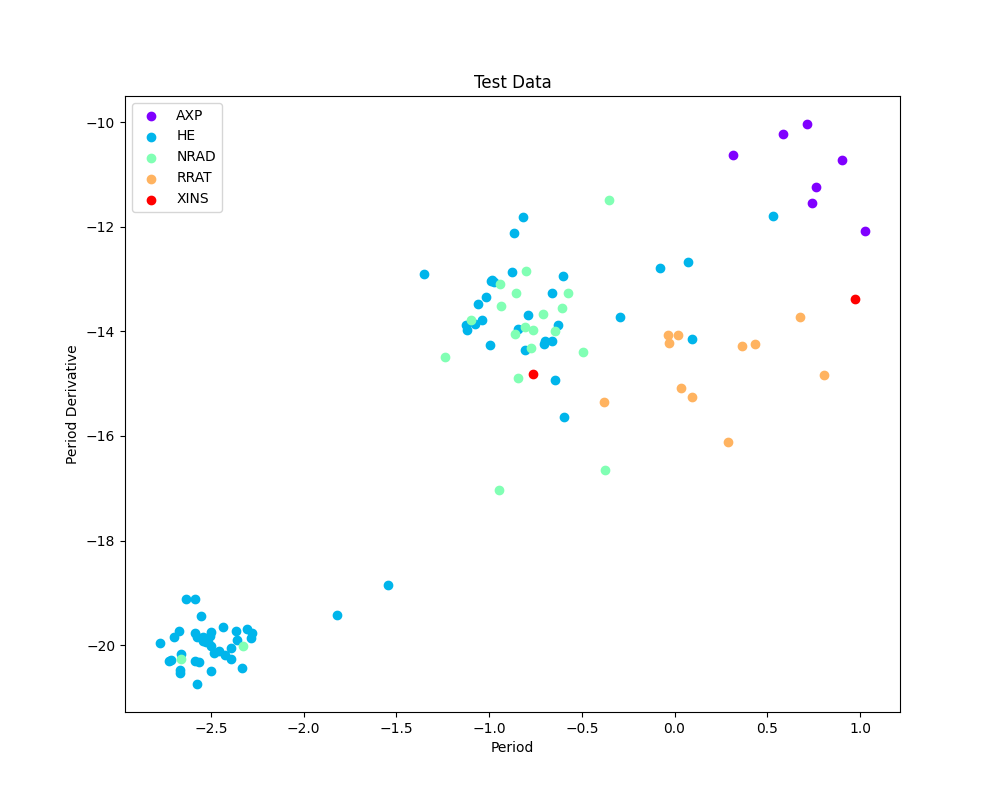
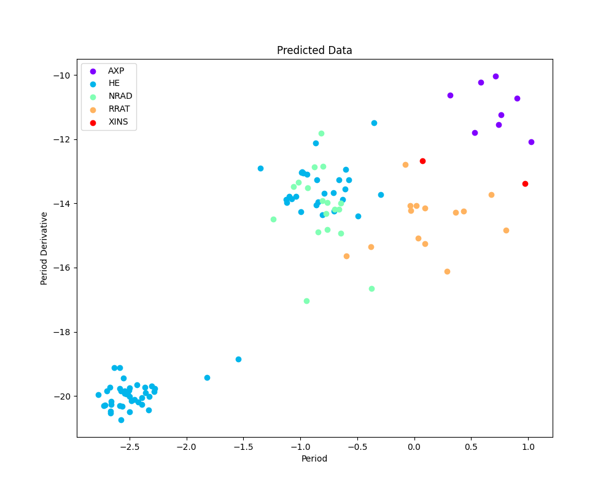

<h1>Pulsar Type Classification using Random Forest</h1>
<h2>Overview</h2>

This project aims to classify pulsars into different types based on their characteristic features, specifically the 
Pulse period (P0), Period derivative (P1), and Surface Magnetic Field (BSURF). The classification is performed
using the Random Forest algorithm, a machine learning technique.

<h2>Dataset</h2>

The dataset used in this project is obtained from the ATNF Pulsar Catalogue, containing information about pulsars'
P0, P1, TYPE, and BSURF parameters.

<h3>Classes</h3>

<strong>AXP:</strong> Anomalous X-ray Pulsar or Soft Gamma-ray Repeater with detected pulsations

<strong>HE:</strong> Spin-powered pulsar with pulsed emission from radio to infrared or higher frequencies

<strong>NRAD:</strong> Spin-powered pulsar with pulsed emission only at infrared or higher frequencies

<strong>RRAT:</strong> Pulsars with intermittently pulsed radio emission

<strong>XINS:</strong> Isolated neutron stars with pulsed thermal X-ray emission but no detectable radio emission

<h2>Requirements</h2>
<ul>
        <li>Python 3.x</li>
        <li>pandas</li>
        <li>numpy</li>
        <li>matplotlib</li>
        <li>scikit-learn</li>
</ul>

<h2>Usage</h2>

<ol>
        <li>Install the required dependencies using:
            <code>pip install pandas numpy matplotlib scikit-learn</code></li>
        <li>Run the project file:
            <code>python main.py</code></li>
        <li>The Random Forest classifier will be trained on the data, and predictions will be made on a test set.</li>
        <li>Accuracy and additional classification metrics will be displayed.</li>
        <li>Three plots will be generated and saved:
            <ul>
                <li>Original Data</li>
                <li>Test Data</li>
                <li>Predicted Data</li>
            </ul>
        </li>
</ol>

<h2>Results</h2>

The Random Forest classifier achieves an accuracy of approximately 78%, indicating its effectiveness in classifying
        pulsar types based on the provided features.

<h3>Classification Metrics</h3>

 
Accuracy: 0.78

<table border="1">
        <tr>
            <th>Type</th>
            <th>Precision</th>
            <th>Recall</th>
            <th>F1-Score</th>
            <th>Support</th>
        </tr>
        <tr>
            <td>AXP</td>
            <td>0.88</td>
            <td>1.00</td>
            <td>0.93</td>
            <td>7</td>
        </tr>
        <tr>
            <td>HE</td>
            <td>0.84</td>
            <td>0.82</td>
            <td>0.83</td>
            <td>68</td>
        </tr>
        <tr>
            <td>NRAD</td>
            <td>0.56</td>
            <td>0.48</td>
            <td>0.51</td>
            <td>21</td>
        </tr>
        <tr>
            <td>RRAT</td>
            <td>0.79</td>
            <td>1.00</td>
            <td>0.88</td>
            <td>11</td>
        </tr>
        <tr>
            <td>XINS</td>
            <td>0.50</td>
            <td>0.50</td>
            <td>0.50</td>
            <td>2</td>
        </tr>
    </table>
<h3>Plots</h3>

<h2>File Descriptions</h2>

<ul>
        <li><code>main.py</code>: Main script containing the implementation of the Random Forest
            classifier.</li>
        <li><code>data/data1.csv</code>: CSV file containing the ATNF Pulsar Catalogue data.</li>
        <li><code>README.md</code>: This file providing an overview of the project.</li>
</ul>

<h2>Acknowledgments</h2>

ATNF Pulsar Catalogue: <a href="http://www.atnf.csiro.au/people/pulsar/psrcat/">Link to ATNF Pulsar
            Catalogue</a>

